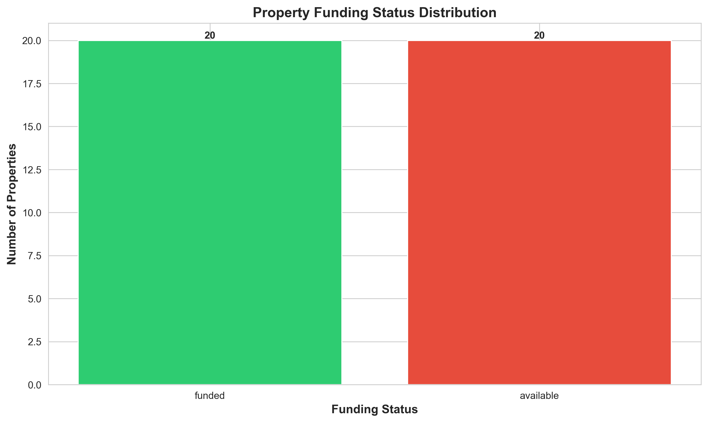
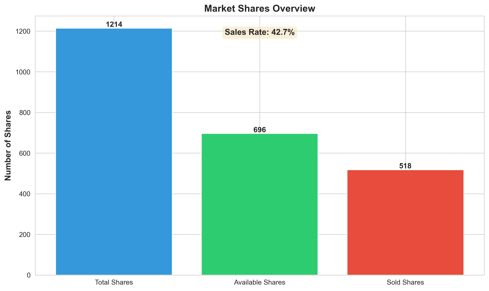
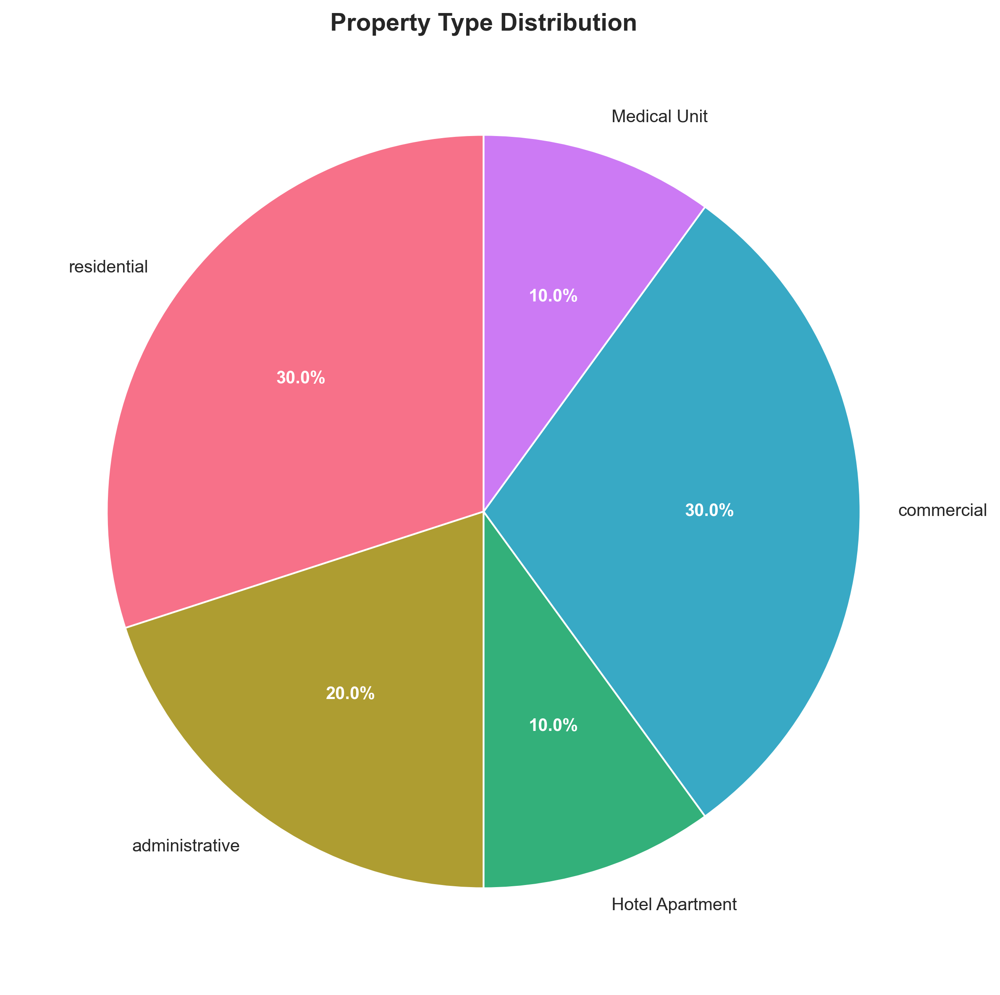
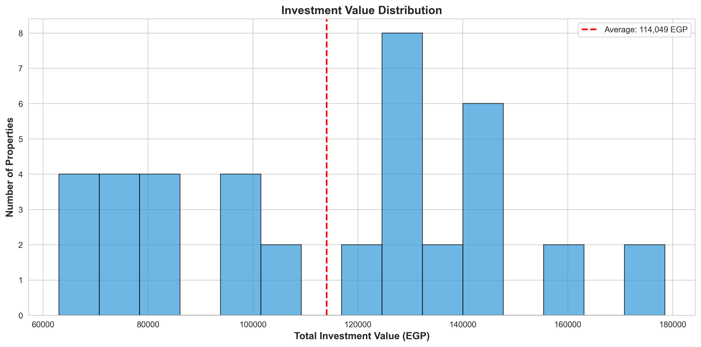
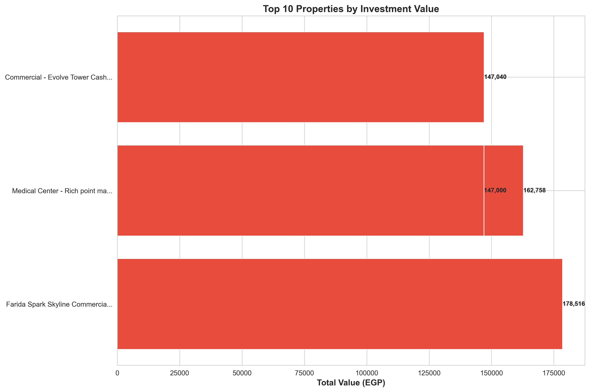
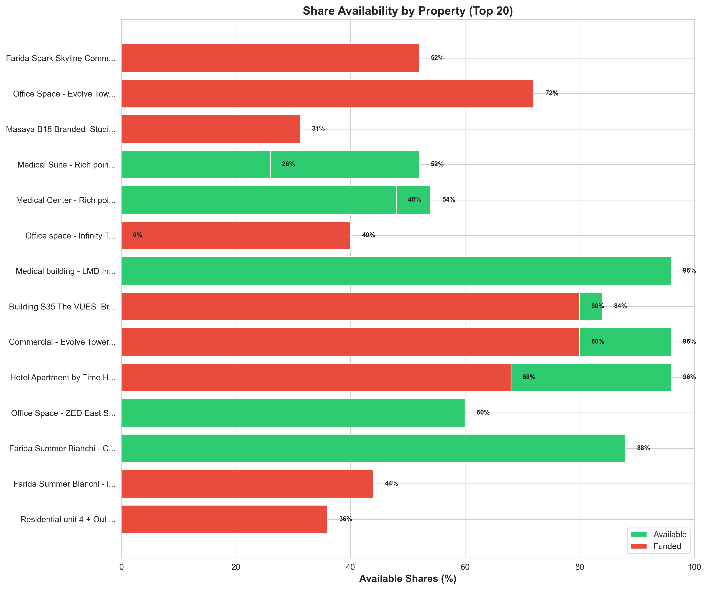

# Farida Estate Investment Platform - Visual Analytics Report

**Generated:** 2026-02-15 21:48:31

**Total Properties Analyzed:** 40

---

## 📊 Key Metrics

- **Total Properties:** 40
- **Total Shares:** 1,214
- **Available Shares:** 696
- **Sold Shares:** 518
- **Sales Rate:** 42.7%

---

## 1. Funding Status Distribution

This chart shows the distribution of properties by their funding status.

---

## 2. Market Shares Overview

Overview of total, available, and sold shares across all properties.

---

## 3. Property Type Distribution

Breakdown of properties by type (residential, commercial, administrative, etc.).

---

## 4. Investment Value Distribution

Distribution of investment values across all properties.

---

## 5. Top 10 Properties by Value

The highest-value investment opportunities currently available.

---

## 6. Share Availability Heatmap

Visual representation of share availability across top 20 properties.

---

## 📈 Investment Insights

- **Available Opportunities:** 20 properties (50.0%)
- **Fully Funded:** 20 properties (50.0%)
- **Average Investment Value:** 114,049 EGP

---

**Report Generated by:** BMad Master Analytics Engine
**Data Source:** Farida Estate SQLite Database
**Visualization Library:** Matplotlib + Seaborn
